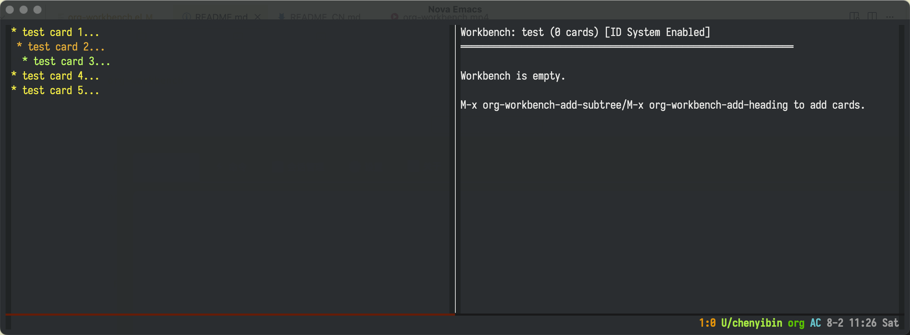

# org-workbench

一个用于 org-mode 的数字卡片工作台系统，为组织和管理笔记提供强大的工具。

兼容 org-mode 以及支持 ID 系统的包，如 org-supertag、org-roam、org-brain 等。

## 概述



org-workbench 提供了一个数字卡片系统，模拟传统的物理卡片工作台，允许您在数字环境中组织和重新排列 org-mode 笔记。它非常适合研究组织、写作项目和论证结构构建。

## 为什么使用 org-workbench？

想象一下，你正在写一篇文章，或者正在头脑风暴思考着新的想法。此时，你不断翻看自己的笔记，将它们与自己脑海中的想法碰撞。但是，你有很多笔记分散在不同的 org 文件中，现在需要把这些内容重新组织成一个逻辑清晰的结构。

**传统方式的问题：**
- 直接在原文件中重新排列会破坏原有的组织结构
- 频繁切换多个文件容易丢失上下文
- 需要考虑复杂的层级关系，操作繁琐

**org-workbench 的解决方案：**
- 创建一个"工作台"，把所有相关内容提取成卡片
- 在安全的环境中实验不同的排列方式，不影响原文件
- 所有卡片都在同一级别，移动和重新组织变得非常简单
- 可以快速跳回原文件进行编辑，保持同步

简单来说，org-workbench 就像给你一个数字化的"卡片工作台"，让你可以像整理实体卡片一样，轻松地重新组织你的笔记内容。

## 功能特性

- **数字卡片系统**：从任何 org-mode 标题创建卡片
- **多工作台**：为不同项目或主题创建独立的工作台
- **持久化存储**：所有工作台状态都会自动保存并在会话间恢复
- **可视化界面**：清晰的 org-mode 大纲，高效导航
- **卡片操作**：使用直观命令添加、删除和组织卡片
- **智能 ID 系统**：当检测到 org-supertag、org-brain 或 org-roam 时自动启用增强功能
- **增强功能**：与源文件同步卡片并跳转到原始位置（当与使用 ID 系统的笔记包配合使用时，比如 org-supertag、org-brain、org-roam 等）
- **向后兼容**：与现有 org-luhmann 设置无缝协作

## 显示格式
工作台使用 org-mode 结构显示卡片，打破原始级别结构，使移动和重新组织卡片更容易：

```
工作台: default (5 张卡片)
════════════════════════════════════════════════════════════

1 测试卡片 1
这是第一张测试卡片的内容。
包含一些用于测试工作台功能的文本内容。

1a 测试分支卡片
这是分支卡片的内容。

1a.1 子标题 1
子标题 1 的内容。

1a.2 子标题 2
子标题 2 的内容。

1a.2.1 更深层子标题
更深层子标题的内容。

2 测试卡片 2
这是第二张测试卡片的内容。
```

注意：星号完全隐藏，但保留所有 org-mode 功能。所有卡片都在同一级别，便于移动和重新组织。

## 安装

### 使用 use-package 和 straight.el

```elisp
(use-package org-workbench
  :straight (:host github :repo "yibie/org-workbench")
  :after org-supertag ; 或 org-roam、org-brain 等
  :config
  (org-workbench-setup))
```

### 手动安装

1. 将 `org-workbench.el` 下载到您的 load-path
2. 添加到您的初始化文件：

```elisp
(require 'org-workbench)
(with-eval-after-load 'org-supertag ; 或 org-roam、org-brain 等
  (org-workbench-setup))
```

## 使用方法

### 基本命令

#### 添加卡片

**添加整个子树（推荐）**
`M-x org-workbench-add-subtree`
1. 将光标放在任何标题上
3. 子树中的所有标题都将被提取为单独的卡片

**仅添加当前标题**
`M-x org-workbench-add-heading`
1. 将光标放在任何标题上
2. 按 `C-c l h`
3. 仅添加当前标题，排除其子标题和内容

#### 管理工作台
`M-x org-workbench-manage`
- 为不同项目创建新工作台
- 重命名或删除现有工作台
- 轻松在工作台之间切换

#### 工作台中的卡片操作

- **移动卡片**：`M-↑`/`M-↓` 上下移动卡片
- **导航**：`n`/`p` 或 `C-n`/`C-p` 在卡片间移动
- **删除卡片**：`C-c C-k` 删除当前卡片
- **清空工作台**：`C-c w c` 清空所有卡片
- **刷新**：`g` 刷新显示

#### 增强功能（当与使用 ID 系统的笔记包配合使用时，比如 org-supertag、org-brain、org-roam 等）

- **跳转到源文件**：`RET` 跳转到卡片的原始位置
- **同步单个卡片**：`C-c s c` 同步当前卡片与其源文件
- **同步所有卡片**：`C-c s a` 同步所有卡片与其源文件

## 配置

### 卡片内容长度
```elisp
(setq org-workbench-card-content-length 500)
```

### ID 系统配置

您也可以手动启用与笔记包兼容的 ID 系统：

```elisp
;; 启用/禁用 ID 系统
(setq org-workbench-enable-id-system t)

;; 启用/禁用自动包检测
(setq org-workbench-auto-detect-id-packages t)

;; 自定义哪些包启用 ID 系统
(setq org-workbench-id-packages '(org-supertag org-brain org-roam))
```

## 使用场景

### 1. 研究项目组织
- 将相关研究笔记添加到工作台
- 按逻辑顺序排列卡片
- 快速跳转到原始笔记进行编辑

### 2. 写作项目规划
- 收集写作大纲的各个部分
- 重新排列章节顺序
- 在写作过程中快速访问参考资料

### 3. 论证结构构建
- 将论点和证据添加为卡片
- 尝试不同的论证顺序
- 构建逻辑清晰的论证结构

### 4. 临时笔记收集
- 为特定主题创建临时集合
- 在不同项目间快速切换
- 保持工作空间整洁

## 技术细节

### 数据存储
- 所有工作台状态都保存在 `org-workbench-save-file` 指定的文件中
- 数据以 Emacs Lisp 格式存储
- 当执行 `org-workbench-setup` 时，所有工作台都会自动加载

### 卡片信息
每个卡片包含：
- `:id`：唯一 ID（当 ID 系统启用时）
- `:number`：卢曼编号
- `:title`：完整标题
- `:content`：截断的内容（用于显示）
- `:level`：原始标题的级别
- `:file`：原始文件路径

### ID 系统行为
- **自动检测**：系统自动检测是否加载了 org-supertag、org-brain 或 org-roam
- **条件功能**：增强功能（同步、跳转到源文件）仅在 ID 系统启用时可用
- **向后兼容**：没有 ID 的现有卡片继续正常工作
- **视觉指示器**：当功能激活时，工作台显示显示"[ID 系统已启用]"

## 许可证

本项目采用 MIT 许可证。

## 作者

Yibie (yibie@outlook.com)

## 相关项目

- [org-supertag](https://github.com/yibie/org-supertag) - org-mode 的超级标签系统
- [org-luhmann](https://github.com/yibie/org-luhmann) - org-mode 的卢曼编号系统
